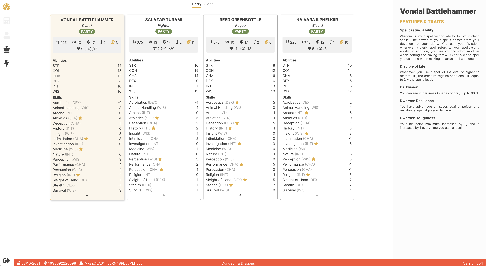

# Dungeon & Dragons (Client)

Don't judge this is just something we whipped up in a couple of hours so we can be happy DnD novices

## Dependencies

- `firebase`
- `yarn`
- `node`

## Installation

Simply run `yarn` in the current directory.

## Getting Started

- `yarn dev`: Run development, HMR server

### Defining Environment Variables

Go into `preact.config.js` and add an environment variable.

## Running Firebase Emulator

For local development purposes, run `firebase emulators:start`. This will start up emulated Firestore on `localhost:9001`.

## License

MIT
